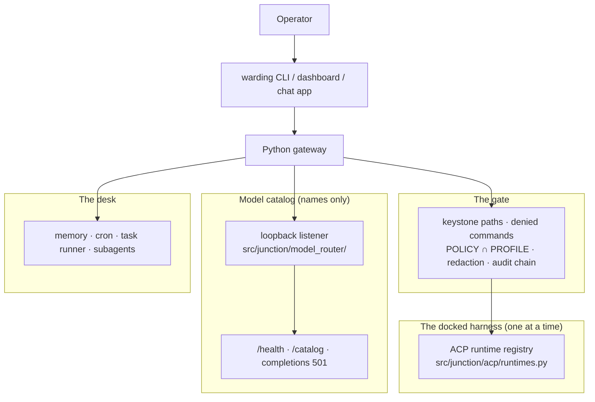

# Architecture — one harness, one gate, one desk

Warding runs **one docked coding agent at a time** on the operator's own
machine, behind its own PreToolUse gate, with a desk (dashboard, CLI, chat
apps, cron, task runner, subagents, memory) around it. A model catalog runs on
loopback beside it; the catalog lists names and forwards nothing.

Decision records: [ADR 0002](docs/adr/0002-two-planes.md) (compose the
catalog beside the gateway, do not dump another tree into it),
[ADR 0003](docs/adr/0003-sidecar-not-vendor.md) (do not vendor another
product's tree), [ADR 0007](docs/adr/0007-builtin-model-catalog.md) (the
built-in catalog), [ADR 0004](docs/adr/0004-security-unchanged.md) (security
invariants), [ADR 0005](docs/adr/0005-preview-not-production.md) (preview,
not production), [ADR 0008](docs/adr/0008-product-rename-warding.md) (the
name).

The upstream component map remains
[`docs/architecture/overview.md`](docs/architecture/overview.md). This file
is the Warding thesis that sits on top of it.

## Shape

Operator → `warding` CLI, dashboard or a chat app → Python gateway → the
gate → **the docked harness**, plus memory / cron / task runner / subagents,
plus a loopback catalog (typically `:4202`).

## The docked harness

`agent.acp_backend` defaults to `auto` via `src/junction/acp/runtimes.py`.
Resolution preference is Cursor, Claude Code (via the ACP project's
`claude-agent-acp` adapter, fetched with `npx` on first run), Codex, Kimi,
DeepSeek Harness, Goose, Grok, Pi, Droid, then `kiro-cli`. Unknown values
degrade to `auto`, not to `kiro-cli`. If no spec-family runtime is installed
and `kiro-cli` is absent, session spawn fails with a runtime-not-found error
rather than implying a hidden install.

**One harness at a time, set globally.** The registry picks one runtime for
the gateway; running two harnesses alongside each other is not a goal and is
not claimed. Switching is one setting; schedules, memory and channels stay.

`agent.provider` stays `acp`. An added harness adapts; it does not widen the
Kiro path. Identity is positive (`is_kiro_backend` / membership sets). Spec:
[`docs/system-specs/modules/harness-parity.md`](docs/system-specs/modules/harness-parity.md).
What is verified per harness is the matrix in
[README](README.md#one-harness-at-a-time); today Claude Code is verified for
chat only and no overnight run is verified on any harness.

Per-harness capability today: cron and subagents can be created from the
dashboard or CLI on any docked harness; cron and subagents *from chat*, and
the agent's mid-turn questions, work on kiro-cli only, because Warding's own
MCP servers are passed to the kiro spec and not yet to spec-family harnesses
(`src/junction/acp/client.py`, `_claude_session_mcp_servers`).

## The gate

Every tool and MCP call passes Warding's own PreToolUse gate
(`src/junction/hooks.py`) before the harness runs it:

- **Keystone paths.** `security_policy.json`, `profiles/`,
  `admission_policy.json` and `computer_use.json` under the data home are in
  `security._SENSITIVE_HOME_DIRS` with `~/.ssh`, `~/.aws`, `~/.gnupg` and the
  rest; read, write and extract verbs are refused. The agent cannot open the
  file that limits it.
- **Denied commands.** `DeniedCommandRule` records enforced only at the gate.
- **`effective = POLICY ∩ PROFILE`**, tightest wins, scope-name-agnostic.
- **Redaction.** Credential shapes are redacted at one chokepoint before
  output reaches a chat surface or the log; always on, no policy key.
- **The audit chain.** Decisions are appended to `security_events.jsonl` as
  an HMAC-SHA256 chain (`src/junction/sel.py`); `warding security verify`
  checks it.
- **The OS sandbox.** Namespace or Seatbelt isolation where a backend exists;
  fails closed where none does unless the operator opts in.

Where each control is fail-closed and where it is fail-open (pre-authorised
tools skip the hook; computer use is refused in band on the dispatch path) is
in [`SECURITY.md`](SECURITY.md) and the
[security deep dive](docs/architecture/security-deep-dive.md).

## The model catalog

`warding up` starts the catalog listener in `src/junction/model_router/`.
Health, a namespaced list of model names, and the role DAG live there.
Catalog slugs (for example `kimi-oauth/k3`, `deepseek/deepseek-v4-pro`) are
names. **The catalog forwards nothing:** completion routes on the listener
answer `501` `model_router_no_forward`, no translation gateway is bundled, no
provider key is held, minted or pasted into chat. The docked harness answers
with the models it already serves. Role pins (`agent.role_models.<role>`)
default to `"auto"` and are validated against the advertised set. Spec:
[`docs/system-specs/modules/model-router.md`](docs/system-specs/modules/model-router.md).

## The desk

Unchanged in role: the gateway owns cross-session memory, cron, the task
runner, subagents, skills, lessons, the dashboard, ten chat channels and
Agent Worlds. Data home identifiers are `JUNCTION_HOME` / `~/.junction` for a
new install. The default build contacts no server of ours; the embedding
model is downloaded from a third-party CDN on first embedding use.

## Degradation

| Catalog listener | Gateway | Operator-visible |
|---|---|---|
| Up | Harness + catalog | Catalog status `degraded` (no translation gateway answers `:4200`, by design) |
| Down | Harness only | Catalog down; gateway still runs |
| Probe fails | Harness only | Unreachable, no secrets |

A missing catalog is not a gateway crash.

## Compose surface

`warding up` (compose, then serve; `warding gateway` is the same server),
`warding planes`, `warding doctor --quick`, `warding doctor` (Planes section
first), and `GET /api/planes` return one snapshot: the harness inventory
(auto preference; kiro-cli last and optional), catalog health, and the role
DAG. They do not spawn agents, leave loopback, or change the Kiro harness
path. `warding router status|catalog|plan` stay the catalog detail views.
Human text for planes, doctor, and `up` is formatted in one function so the
three surfaces cannot drift.
