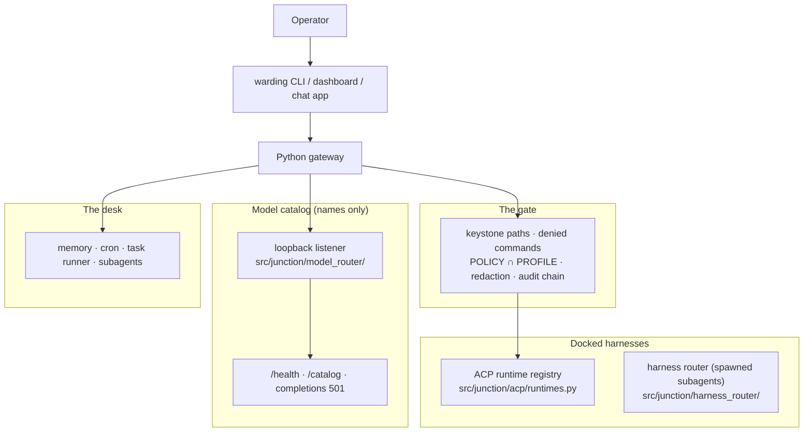

# Architecture — docked harnesses, one gate, one desk

Warding runs **docked coding agents** on the operator's own machine, behind
its own PreToolUse gate, with a desk (dashboard, CLI, chat apps, cron, task
runner, subagents, memory) around them. Chat sessions run the one harness the
operator chooses in one setting; spawned subagents can be routed to another
installed harness by the harness router, which picks a harness and never
forwards provider traffic. A model catalog runs on loopback beside them; the
catalog lists names and forwards nothing.

Decision records: [ADR 0002](docs/adr/0002-two-planes.md) (compose the
catalog beside the gateway, do not dump another tree into it),
[ADR 0003](docs/adr/0003-sidecar-not-vendor.md) (do not vendor another
product's tree), [ADR 0007](docs/adr/0007-builtin-model-catalog.md) (the
built-in catalog), [ADR 0004](docs/adr/0004-security-unchanged.md) (security
invariants), [ADR 0005](docs/adr/0005-preview-not-production.md) (preview,
not production), [ADR 0008](docs/adr/0008-product-rename-warding.md) (the
name).

The upstream component map remains
[`docs/architecture/overview.md`](docs/architecture/overview.md). This file
is the Warding thesis that sits on top of it.

## In plain words

An **agent** is a helper that does a job on your computer: it reads files, runs
commands, writes code. A helper thinks with a **model**, and models come from
different companies, each reached through an account you already signed in to
with that helper. Warding ships no helper and no model of its own.

What Warding adds around the helpers you already have:

- **The harness.** Warding knows how to start the helpers installed on your
  machine (Cursor, Claude Code, Codex, OpenCode and the rest) under your own
  login. Your chat sessions run the one you choose in one setting, or the
  first one Warding finds.
- **The harness router.** When work is handed to a subagent, Warding can
  send that subagent to another installed helper: flat-rate plan quota before
  metered spend, the kind of task, and a rest after a usage limit or a failed
  login. It chooses a helper; it never carries that helper's traffic to a
  provider.
- **The gate.** Tool calls pass Warding's own check before the helper runs
  them, under a policy the helper can neither read nor rewrite.
- **The catalog.** A list of model names on loopback. It is a list, not a
  pipeline: it names models and forwards nothing.

So: your own machine, your own sign-ins, no provider keys typed into a chat
box. If the catalog is not running, the helpers still work; Warding just shows
fewer names.

**Merged versus local.** What this file describes is merged on `main` and
ships with a Warding build. Work still on a branch — a fix in progress or a new
surface not yet merged — is *not* part of the product until a human merges it
to `main`. The in-flight lanes live in [`docs/TASK_MAP.md`](docs/TASK_MAP.md);
this file calls out anything local where it appears.

**Update trigger.** When a change moves a boundary or changes behavior this file
describes — the gate, the auto order, the router, the degradation path, the
compose surface — update this file in the **same change**. `AGENTS.md` routes
the truth; this file must not drift behind it.

## Shape

Operator → `warding` CLI, dashboard or a chat app → Python gateway → the
gate → **the docked harness** (a spawned subagent may be routed to another
installed one), plus memory / cron / task runner / subagents, plus a loopback
catalog (typically `:4202`).

## The docked harness

`agent.acp_backend` defaults to `auto` via `src/junction/acp/runtimes.py`.
Resolution preference is Cursor, Claude Code (via the ACP project's
`claude-agent-acp` adapter, fetched with `npx` on first run), Codex, Kimi,
DeepSeek Harness, Goose, Grok, OpenCode (`opencode acp`), Pi, Droid, then
`kiro-cli`. Unknown values degrade to `auto`, not to `kiro-cli`. `auto` is
resolved to a concrete harness once, when a provider is created, so the
harness that runs and the namespace its model ids are spelled in come from one
decision. If no spec-family runtime is installed and `kiro-cli` is absent,
session spawn fails with a runtime-not-found error rather than implying a
hidden install.

**Chat runs the harness you choose; subagents can be routed.** Chat
sessions, channels and scheduled jobs run the one harness `agent.acp_backend`
names; switching is one setting, and schedules, memory and channels stay.
Spawned subagents can be routed to another installed harness by the harness
router (`src/junction/harness_router/`): a routed `spawn_run` becomes a
per-session `acp_backend_override` on the provider factory, on a dedicated
process, and the chosen harness runs under its own login. The router spends
flat-rate subscription quota before metered spend, spreads load by each
lane's remaining window, matches the kind of task, and rests a lane after a
usage limit, rate limit or failed login. It chooses a harness and never
forwards provider traffic, stores a key or reads a credential; a model id
never crosses from one harness's namespace into another's (H12). Spec:
[`docs/system-specs/modules/harness-router.md`](docs/system-specs/modules/harness-router.md).

`agent.provider` stays `acp`. Multi-ACP must not be re-landed. An added
harness adapts; it does not widen the Kiro path. Identity is positive
(`is_kiro_backend` / membership sets). Spec:
[`docs/system-specs/modules/harness-parity.md`](docs/system-specs/modules/harness-parity.md).
What is verified per harness is the matrix in
[README](README.md#the-harness-you-choose-and-where-subagents-go); today
Claude Code is verified for chat only, OpenCode and the router are registered
and unit-tested but not verified at runtime, and no overnight run is verified
on any harness.

Per-harness capability today: cron and subagents can be created from the
dashboard or CLI on any docked harness; cron and subagents *from chat*, and
the agent's mid-turn questions, work on kiro-cli only, because Warding's own
MCP servers are passed to the kiro spec and not yet to spec-family harnesses
(`src/junction/acp/client.py`, `_claude_session_mcp_servers`).

## The gate

Every tool and MCP call passes Warding's own PreToolUse gate
(`src/junction/hooks.py`) before the harness runs it:

- **Keystone paths.** `security_policy.json`, `profiles/`,
  `admission_policy.json` and `computer_use.json` under the data home are in
  `security._SENSITIVE_HOME_DIRS` with `~/.ssh`, `~/.aws`, `~/.gnupg` and the
  rest; read, write and extract verbs are refused. The agent cannot open the
  file that limits it.
- **Denied commands.** `DeniedCommandRule` records enforced only at the gate.
- **`effective = POLICY ∩ PROFILE`**, tightest wins, scope-name-agnostic.
- **Redaction.** Credential shapes are redacted at one chokepoint before
  output reaches a chat surface or the log; always on, no policy key.
- **The audit chain.** Decisions are appended to `security_events.jsonl` as
  an HMAC-SHA256 chain (`src/junction/sel.py`); `warding security verify`
  checks it.
- **The OS sandbox.** Namespace or Seatbelt isolation where a backend exists;
  fails closed where none does unless the operator opts in.

Where each control is fail-closed and where it is fail-open (pre-authorised
tools skip the hook; computer use is refused in band on the dispatch path) is
in [`SECURITY.md`](SECURITY.md) and the
[security deep dive](docs/architecture/security-deep-dive.md).

## The model catalog

`warding up` starts the catalog listener in `src/junction/model_router/`.
Health, a namespaced list of model names, and the role DAG live there.
Catalog slugs (for example `kimi-oauth/k3`, `deepseek/deepseek-v4-pro`) are
names. **The catalog forwards nothing:** completion routes on the listener
answer `501` `model_router_no_forward`, no translation gateway is bundled, no
provider key is held, minted or pasted into chat. The docked harness answers
with the models it already serves. Role pins (`agent.role_models.<role>`)
default to `"auto"` and are validated against the advertised set. Spec:
[`docs/system-specs/modules/model-router.md`](docs/system-specs/modules/model-router.md).

## The desk

Unchanged in role: the gateway owns cross-session memory, cron, the task
runner, subagents, skills, lessons, the dashboard, ten chat channels and
Agent Worlds. Data home identifiers are `JUNCTION_HOME` / `~/.junction` for a
new install. The default build contacts no server of ours; the embedding
model is downloaded from a third-party CDN on first embedding use.

## Degradation

| Catalog listener | Gateway | Operator-visible |
|---|---|---|
| Up | Harness + catalog | Catalog status `degraded` (no translation gateway answers `:4200`, by design) |
| Down | Harness only | Catalog down; gateway still runs |
| Probe fails | Harness only | Unreachable, no secrets |

A missing catalog is not a gateway crash.

## Compose surface

`warding up` (compose, then serve; `warding gateway` is the same server),
`warding planes`, `warding doctor --quick`, `warding doctor` (Planes section
first), and `GET /api/planes` return one snapshot: the harness inventory
(auto preference; kiro-cli last and optional), catalog health, and the role
DAG. They do not spawn agents, leave loopback, or change the Kiro harness
path. `warding router status|catalog|plan` stay the catalog detail views. The
JSON snapshot carries no dedicated vendor-CLI key: optional is an inventory
flag on the runtime row. Human text for planes, doctor, and `up` is formatted
in one function so the three surfaces cannot drift.

`warding route` (`status`, `pick`, `run`, `check`, `init`, `clear`), the
read-only `route_task` MCP tool and `/api/routing/*` are the harness router's
surfaces: lanes, cooldowns, the pick per kind of work, and one routed prompt
from a terminal.
