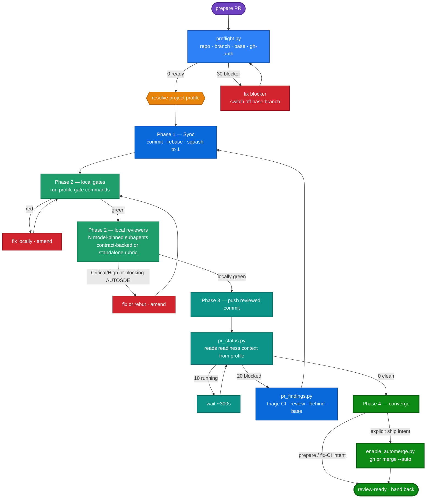
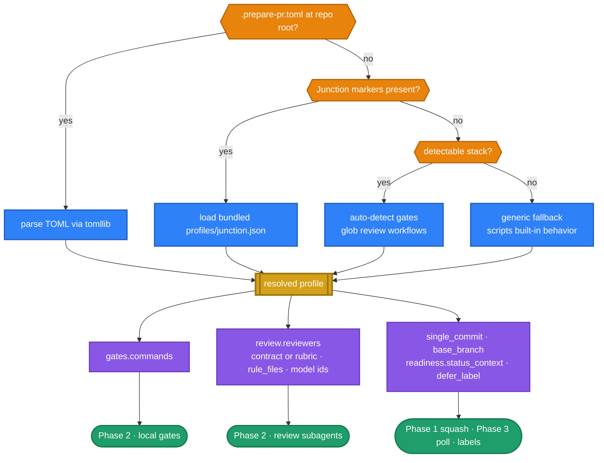

# Design: Portable `prepare-pr` via Pluggable Project Profiles

- **Status:** Implemented in PR #662 — resolver + bundled profile + `pr_status.py` readiness override + `SKILL.md` refactor + tests.
- **Author:** Junction maintainers (drafted with Kiro)
- **Date:** 2026-07-28
- **Related (repo paths; the `docs/` ones are dev-only and not shipped in the wheel):** `docs/ci/ci-and-reviews.md` (current-state source of truth for how CI + `prepare-pr` work today), the `prepare-pr` skill source at `src/junction/builtin_skills/junction-dev/prepare-pr/`, and the `junction-worktree-dev` skill.

---

## 1. Problem

The `prepare-pr` skill is one of the most valuable pieces of Junction's own dev workflow: it drives a working tree to a review-ready PR (commit → sync → squash → open/update → poll CI + review bots → fix legitimate Critical/High findings → converge), and it standardizes how we ship changes to Junction.

But the skill reads today as specific to **Junction**. Its prose bakes in one project's conventions, so an agent running it in any other repo would follow instructions that don't apply. We want two things at once, and they appear to be in tension:

1. Keep the skill **built-in** and keep it **standardizing Junction development** (the tuned gates, review bots, labels, and single-commit rule that make our PRs consistent).
2. Make the skill **useful in any `gh`-based repo**, so other projects benefit from the same commit→green loop.

This doc shows the tension is only in the *prose*, not the mechanism, and proposes a pluggable **project profile** layer that resolves both goals without forking the skill.

## 2. Why it matters

- **Reuse.** The commit→sync→squash→open→poll→fix→converge loop is genuinely project-agnostic. Locking it to Junction wastes a good abstraction.
- **Standardization stays intact.** A profile lets Junction keep its exact gates/reviewers/labels as *data*, so Junction devs get zero-config standardization while other repos get a working default.
- **No parallel systems.** Evolving the one proven skill outward (a discovered profile layer) beats spawning a second `junction-prepare-pr` skill that drifts from the generic one.

## 3. Current state — what is actually coupled

Grounded in a read of the skill's five scripts and `SKILL.md`:

### 3.1 The scripts are already ~95% generic

| Script | Coupling to Junction |
| --- | --- |
| `preflight.py` | **None.** Base branch is auto-detected: existing PR's base → `origin/HEAD` → `main`. Pure `git`/`gh`. |
| `diff_signals.py` | **None.** Changed-file + flagged-signal reporting over `git diff`. |
| `pr_findings.py` | **None.** Failed-step + log-tail + unresolved-thread extraction over `gh`, plus reviewer findings for the current head with a stable `span=` identity (path + reviewer/kind; no file reads -- finding paths are untrusted comment text); the `[<NAME>-REVIEWED]` stamp contract is discovered from the comments, not configured. |
| `enable_automerge.py` | **None.** Thin idempotent wrapper around `gh pr merge --auto`. |
| `pr_status.py` | **One line:** `READINESS_CONTEXT = "PR Readiness"`. And it already **degrades gracefully** — when that aggregate status is absent it falls back to the full check rollup ("legacy PRs without it still use the full rollup"). The reviewer-marker gate (#2550) is likewise self-configuring: it evaluates whatever `[<NAME>-REVIEWED]` stamps bot comments carry (none found → no gate), with `--reviewers` / `PREPARE_PR_REVIEWERS` as the optional scoping seam. The pull_request-run-for-head assertion applies only when the rollup is Actions-shaped AND the repo demonstrably dispatches pull_request-event runs at all — a push-trigger-only repo is never held to an event it does not use. |

So the executable core already runs anywhere `git` + `gh` are present. Decisions are driven by script **exit codes** (`0 clean / 10 running / 20 blocked / 2 env`), which are project-neutral.

### 3.2 The coupling lives in the `SKILL.md` prose

Everything project-specific is prose the agent reads, not code:

- **Local gates** hardcoded to Junction's stack: `pytest / isort / flake8 / mypy` + `tsc -b / vitest`.
- **Reviewers** hardcoded to mirror named workflows: `.github/workflows/{codex,claude,code}-review.yml` (no way to add a repo's own reviewers).
- **Rule sources:** `AUTOSDE.yaml` + `website/AUTOSDE.yaml`, `CLAUDE.md`, `AGENTS.md`.
- **Conventions:** the single-commit-per-PR invariant; the `readiness: passed` / `readiness: action required` status + labels; base branch `main`.
- A hard reference to the `junction-worktree-dev` skill's Rule 2 gate.

**Conclusion:** portability is a *content* refactor (split the prose), not a *distribution* change (demote to local) and not a *rewrite* (the scripts stay).

## 4. Goals / Non-goals

**Goals**
- One generic core loop, driven by a **project profile** that supplies the parts that vary per repo.
- The profile is **discovered or configured**, never hardcoded in the core prose.
- **Zero-config for Junction:** a bundled `junction` profile is auto-selected when the skill detects it is running in the Junction repo.
- **Working default anywhere else** via auto-detection, degrading to the generic fallback the scripts already implement.
- Keep the skill **built-in** (shipped via `package_data`), **dormant** until invoked, with narrow **intent-phrased triggers**.

**Non-goals**
- Not rewriting the scripts (only a small optional readiness-context override in `pr_status.py`).
- Not forking into two skills.
- Not changing Junction's actual CI workflows or labels.
- Not building a general plugin marketplace — profiles are simple bundled/local files, not installable third-party packages.

## 5. Design — the pluggable project profile

### 5.1 Three axes a profile supplies

The profile is the single home for everything that varies per repo. The review bots are just the most visible slice:

1. **Local gates** — the test/lint/type commands the Phase-2 local gate runs (Junction: `pytest`, `isort`, `flake8`, `mypy`, `tsc -b`, `vitest`).
2. **Local reviewers** — a list of local review subagents, **one spawned per entry** (each pinned to a concrete `spawn_run` **model id**, with a `model_tier` fallback). A reviewer is either **contract-backed** (it mirrors a specific CI gate by reading that workflow's contract) or **standalone** (it reviews against an inline `rubric` with no CI counterpart). Reviewers do **not** have to bind to CI — a repo can add local-only reviewers (security, performance, a11y, house style) that no server gate mirrors, and a repo with no CI reviewers at all can still define reviewers by rubric. All reviewers inherit the shared `rule_files` (AUTOSDE / AGENTS.md).
3. **Conventions** — single-commit rule (on/off), the readiness status context name + managed labels, an optional long-term-defer label, and the base branch override.

### 5.2 Resolution order (fail-safe, most-specific-wins)

```
1. Explicit config   →  .prepare-pr.toml at repo root                (highest precedence)
2. Junction markers  →  load bundled profiles/junction.json
3. Auto-detect stack →  infer gates + glob reviewers from *review*.yml
4. Generic fallback  →  scripts' built-in behavior                   (lowest precedence)
```

Key nuance: **the `junction` profile is NOT an unconditional global default.** It is auto-selected only when the skill detects it is in the Junction repo (see markers in §5.4). This prevents Junction's gates/labels from misfiring in an unrelated repo.

### 5.3 Auto-detection rules (config-free path)

When there is no `.prepare-pr.toml`:

- **Gates from ecosystem files:**
  - `pyproject.toml` / `setup.cfg` → `pytest` (+ `mypy`, `flake8`, `isort` if configured)
  - `package.json` → scripts for `test` / `build` / `lint` (e.g. `vitest`, `tsc -b`)
  - `Cargo.toml` → `cargo test` / `cargo clippy`
  - `go.mod` → `go test ./...` / `go vet`
  - `Makefile` with a `check`/`test` target → `make check`
- **Reviewers:** glob `.github/workflows/*review*.yml` and create one contract-backed reviewer per gate found. A repo may also declare standalone `rubric` reviewers with no CI counterpart. If neither exists, skip local review and rely on the server poll (the scripts still gate via exit codes).
- **Conventions:** default to single-commit *off* unless a marker says otherwise; base branch from `preflight.py`'s existing detection; readiness context via the `pr_status.py` fallback (full rollup) unless a profile names one.

### 5.4 Junction marker detection

The `junction` profile auto-selects when the repo root contains all of its markers: `AUTOSDE.yaml` plus the two review prompts its reviewers apply (`.github/review-prompts/gpt-review-core.md` and `.github/review-prompts/opus-validate.md`). Presence of these is a strong, low-false-positive signal that we are in Junction (or a faithful fork), and it selects the profile exactly where its reviewers' contracts exist, so loading the tuned profile is safe.

### 5.5 Profile schema (`.prepare-pr.toml`)

A minimal, stdlib-parseable (Python 3.11 `tomllib`) file. All keys optional; anything omitted falls back to auto-detect then generic.

```toml
[project]
base_branch = "main"          # optional; else preflight.py auto-detects
single_commit = true          # enforce one-commit-per-PR squash

[gates]
# ordered list of shell commands; all must exit 0 before a push
commands = [
  "python -m pytest -q",
  "isort --check-only src test",
  "flake8 src test",
  "mypy src/",
  "npm --prefix website run build",
  "npm --prefix website test",
]

[review]
# Shared rule files EVERY reviewer inherits: the base-ref AUTOSDE rules and the
# AGENTS.md conventions (root = backend, website/ = frontend). CLAUDE.md is
# intentionally omitted — it holds no rules, only an `@AGENTS.md` import pointer.
rule_files = ["AUTOSDE.yaml", "website/AUTOSDE.yaml", "AGENTS.md", "website/AGENTS.md"]

# Each [[review.reviewers]] entry becomes ONE local review subagent, spawned via
# spawn_run and pinned to `model` (`model_tier` = fallback tier when that exact
# id is unavailable — drop a tier + warn). A reviewer is either:
#   • contract-backed → `contract` points at a CI workflow it MIRRORS, or
#   • standalone      → `rubric` is an inline charter with no CI counterpart.
# Reviewers need NOT bind to CI: add repo-specific local reviewers freely.
# spawn_run concurrency floors at 3 and auto-sizes up from host memory/CPU
# (config agent.max_subagents), so extra reviewers just queue — never error.

# contract-backed — mirrors a repository's AI review CI gate
[[review.reviewers]]
name = "gpt"
model = "gpt-5.6-sol"        # concrete spawn_run model id (served GPT-5.x tier)
model_tier = "gpt-5.x"
contract = ".github/workflows/ai-review.yml"

# standalone — applies a review contract kept in the repository
[[review.reviewers]]
name = "opus"
model = "claude-opus-4.8"
model_tier = "claude-opus-4.7"
rubric = "Apply the base-ref .github/review-prompts/opus-discovery.md, then opus-validate.md over the discovery candidates."

# standalone — a local-only reviewer with no CI gate to mirror
[[review.reviewers]]
name = "a11y"
model = "gpt-5.6-sol"
model_tier = "gpt-5.x"
rubric = "Flag WCAG 2.2 AA regressions in changed UI: missing labels, low contrast, keyboard traps, focus order."

[readiness]
status_context = "PR Readiness"   # optional override; else pr_status.py falls back to full rollup
defer_label = ""                  # optional: a label that formally defers a gate
```

The bundled `profiles/junction.json` encodes Junction's own configuration as a machine-readable profile the resolver loads directly, so Junction needs no in-repo `.prepare-pr.toml`. Junction runs no AI reviewer in CI, so both of its reviewers (`gpt` and `opus`) are standalone: each rubric names the review contract in `.github/review-prompts/` that reviewer applies.

> **Why one contract per reviewer + multi-model by default (not dimension-split).** Contract-backed reviewers reproduce each CI gate's bar locally, so blocking findings surface pre-push instead of a CI round later, and Junction's standalone reviewers apply a full review contract each rather than one dimension of one; pinning each reviewer to a different vendor buys cross-model blind-spot coverage (the same principle the `llm-council` skill is built on — a same-model panel echoes one bias). Splitting one model across dimensions (correctness vs contracts, the pre-#616 A/B design) adds little as models get stronger, since one capable reviewer covers both in a pass — so the default spends the parallel budget on **model diversity**, not dimension slices.
>
> **This is a default, not a constraint.** The `[[review.reviewers]]` mechanism does not stop anyone from building dimension-based review: a user can define standalone `rubric` reviewers split by concern (a correctness reviewer + a contracts reviewer, exactly the old A/B charters) — with or without any CI gate to mirror. Junction simply *chooses* one full contract per reviewer by default. Per-dimension charters are especially worth adding for very large diffs, where a single reviewer's attention/context is the bottleneck.

### 5.6 Script changes

- **`resolve_profile.py`** (NEW): implements the §5.2 resolution order and emits the resolved profile as JSON (`{source, base_branch, single_commit, gates[], rule_files[], reviewers[], readiness{}}`). Stdlib only, Python 3.9+; parses an external `.prepare-pr.toml` via `tomllib` (3.11+) or `tomli`, and errors loudly (exit 2) rather than silently ignoring a config it cannot parse. The bundled Junction profile ships as `profiles/junction.json` (stdlib `json`, so the marker path needs no TOML parser and works on the 3.10 CI leg).
- **`pr_status.py`:** accepts an optional readiness-context name (`--readiness-context` / `PREPARE_PR_READINESS_CONTEXT`) so a profile can name a non-default aggregate status; **keeps today's fallback** to the full rollup when unset or absent.
- All other scripts: unchanged.

### 5.7 Degradation ladder

| Situation | Behavior |
| --- | --- |
| `.prepare-pr.toml` present | Use it verbatim. |
| Junction markers present | Load bundled `junction` profile. |
| Other repo, detectable stack | Auto-detected gates + globbed reviewers. |
| No reviewers (no workflows to mirror, none declared) | Skip local review; rely on server poll (scripts still gate via exit codes). |
| No readiness status | `pr_status.py` uses the full check rollup (existing behavior). |

### 5.8 Diagram — the code-review loop (where the profile plugs in)

The bounded loop is project-agnostic; the **green** nodes are the only places the profile supplies data. Decisions come from `pr_status.py` exit codes, not eyeballing.



Everything outside the green nodes is identical across repos. Swapping the profile re-skins the gates, the reviewers, and the readiness signal without touching the loop.

### 5.9 Diagram — how configuration (the profile) is injected

Resolution is most-specific-wins (amber decisions); the resolved profile (gold) fans its three axes (purple) into the loop's green nodes.



The three axes (§5.1) map one-to-one onto the loop's green nodes. Anything a profile omits falls back down the resolution ladder (§5.7), so a repo with no config still runs the loop on auto-detected gates and the scripts' generic behavior.

### 5.9 The reviewer-marker grammar (spec of record)

The `[<NAME>-REVIEWED]` / `[BLOCK-MERGE]` markers are a load-bearing contract
between the review bots that EMIT them and the two parity-pinned parser copies
in `pr_status.py` and `pr_findings.py` that CONSUME them. No reviewer in this
repository's CI emits them; the parsers serve any repository whose review bots
post the grammar below, and find nothing to gate on where none does. An emitter
change that alters the emitted shape silently orphans the parsers — the freshness gate then sees no
stamps and stops gating — so any change to either side must update this
section and both parser regexes together
(`test_prepare_pr_findings.py::TestMarkerRegexParity` pins the two copies to
each other).

The grammar, one marker per line inside the bot's PR comment body:

- `[<NAME>-REVIEWED] <sha>` — proof the review ran for that commit. `<NAME>`
  is `[A-Z][A-Z0-9_-]*` (e.g. `GPT`, `OPUS`, `DESIGN`, `UX`); `<sha>` is a
  7–40 char lowercase hex prefix of the head SHA (emitters normally write the
  full 40).
- `[BLOCK-MERGE] <sha>` — emitted ADDITIONALLY, only for a blocking verdict on
  that same commit. Never emitted for advisory findings.
- Finding lines start with the literal token `BLOCKING` or `FINDING`, followed
  by `-- <file>:<line>` (GPT lane) or the bold Opus form
  `**BLOCKING — <file>:<line> — <title>**`; the parsers accept `--` or an
  em-dash, optional bold markers, and an absent second separator.

Consumption rules the parsers implement: only comments whose author is a Bot
AND whose login is a trusted marker author count — by default
`github-actions[bot]`, the actor a review workflow posts through, because
`user.type == "Bot"` alone is spoofable by a third-party app that echoes
PR-controlled text (`--marker-authors` / `PREPARE_PR_MARKER_AUTHORS` widens
the allowlist for a repo whose reviewers post under app-specific logins); an
agent's own disposition comments quote these tokens verbatim and are excluded
by both checks; reviewer IDENTITY comes from workflow-authored bytes, never
from model output — each lane's comment starts with its template-written
upsert key, bound to a reviewer name (the default bindings are
`<!-- codex-ai-review -->` → GPT, `<!-- claude-ai-review -->` → OPUS,
`<!-- design-review -->` → DESIGN, `<!-- ux-review -->` → UX;
`--marker-bindings` / `PREPARE_PR_MARKER_BINDINGS` overrides them), and a stamp
counts only when the bound lane's own name matches it, so injected model
output in one lane can never grant another reviewer's freshness whatever
names it emits (its `[BLOCK-MERGE]` still gates from any trusted comment:
injection can deny, never forge); bots update their comment in place, so a
marker naming a
superseded SHA is history, not signal; freshness is OR-ed across comments per
reviewer name. Discovery mode holds every stamp found to freshness but does
not require presence; naming reviewers (`--reviewers` /
`PREPARE_PR_REVIEWERS`) additionally REQUIRES each named reviewer to have a
fresh stamp, so a pinned fleet cannot be silently un-gated by an emitter
drift or a bot that fails to post. `TestMarkerRegexParity` pins the two
consumer copies to each other.

## 6. Distribution — keep it built-in

Built-in and portable are **not** in conflict:

- Ship the generic `SKILL.md` + scripts + `profiles/junction.json` via `package_data` (matches the "skills ship as builtins" convention).
- Keep the trigger **intent-phrased and narrow** ("prepare PR", "make it review-ready", "fix CI", …) so the skill stays **dormant** until explicitly invoked and never hijacks unrelated frontend/CSS/generic work.
- Other users get the generic behavior + auto-detection; Junction devs get the tuned profile with zero config.

## 7. Proposed layout after refactor

```
src/junction/builtin_skills/junction-dev/prepare-pr/
  SKILL.md                    # generic core loop + "Project profile" section
  profiles/
    junction.json             # bundled Junction profile (gates, reviewers, labels, single-commit)
  scripts/
    preflight.py
    resolve_profile.py        # NEW — resolves the profile to JSON
    diff_signals.py
    pr_status.py              # + optional --readiness-context / env override
    pr_findings.py
    enable_automerge.py
```

(This is the packaged source that ships via `package_data`; the runtime copy is synced to `~/.junction/skills/…` at startup. An optional `.prepare-pr.toml` lives at a *consuming* repo's root — not in the skill.)

## 8. Migration & backward compatibility

- Junction behavior is **unchanged**: the `junction` profile reproduces today's exact gates/reviewers/labels, auto-selected by markers.
- No `.prepare-pr.toml` is added to the Junction repo (the bundled profile covers it) — but one *may* be added later to make the config explicit/self-documenting.
- The scripts remain backward-compatible; the readiness override is opt-in with the existing fallback intact.

## 9. Alternatives considered

1. **Fork into `prepare-pr` (generic) + `junction-prepare-pr` (specific).** Rejected: two skills drift; violates the "evolve one abstraction outward, don't spawn a parallel system" principle. The profile layer gives the same separation without duplication.
2. **Extract only the scripts as a generic builtin; leave the prose tuned to Junction.** Rejected: the scripts are already generic — the *value* being generalized is the loop/prose, so this leaves the actual coupling in place.
3. **Demote the skill to local-only (non-builtin).** Rejected: conflicts with the "ship skills as builtins" convention and needlessly gives up standardization; the coupling is prose, solvable without changing distribution.
4. **Keep as-is.** Rejected: blocks reuse for no benefit; the refactor is modest (prose split + one small script hook).

## 10. Open questions

- **Profile format:** `.prepare-pr.toml` (TOML via `tomllib`) vs a `[tool.prepare-pr]` table inside `pyproject.toml` for Python repos. Leaning TOML root file for language-neutrality.
- **Gate command trust:** running profile-supplied shell commands is arbitrary code execution by design (it's the repo's own dev config). Confirm this is acceptable, or gate first-run on user confirmation.
- **Marker strictness:** how many Junction markers must match to auto-load the `junction` profile (all vs a quorum) to stay robust across forks.
- **Concrete model ids:** the bundled profile pins the `kiro-cli` ids `gpt-5.6-sol` and `claude-opus-4.8`. Note the bare `gpt-5.6` is NOT served (spawns fail) — the GPT reviewer must pin the `-sol` tier.
- **Profile-resolution mechanism (resolved):** implemented as the deterministic `resolve_profile.py` helper emitting resolved JSON — chosen for determinism + testability over prose-driven parsing.
- **Model-tier fallback wording:** how loudly to warn when a mirror's pinned `model` id is unavailable and it drops to the `model_tier` fallback (local-green is then a weaker signal).

## 11. Scope of work (if approved)

- Split `SKILL.md`: generic core loop + a "Project profile resolution" section (§5.2–5.5).
- Add `profiles/junction.json` carrying the current Junction specifics.
- Add the optional readiness-context override to `pr_status.py` (keep the fallback).
- Decide the profile-resolution mechanism (prose vs `resolve_profile.py`; §5.6) and implement it.
- Document `.prepare-pr.toml` for external repos.
- Verify in a worktree; the change is prose + 1–2 small script changes, no CI-workflow changes.
